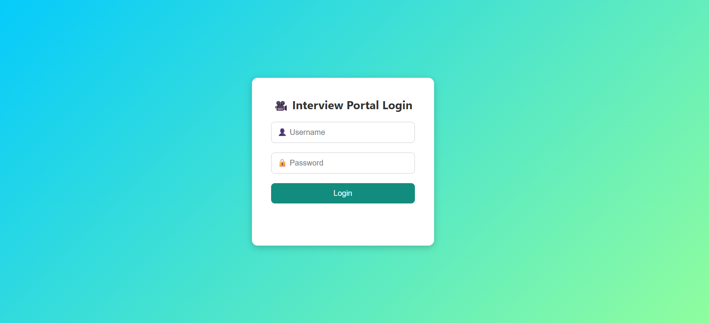
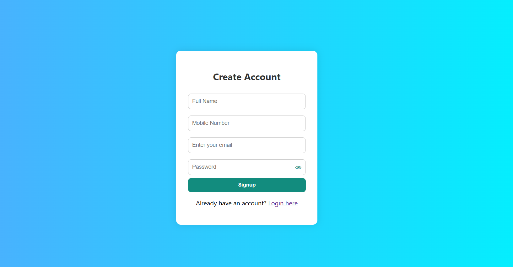
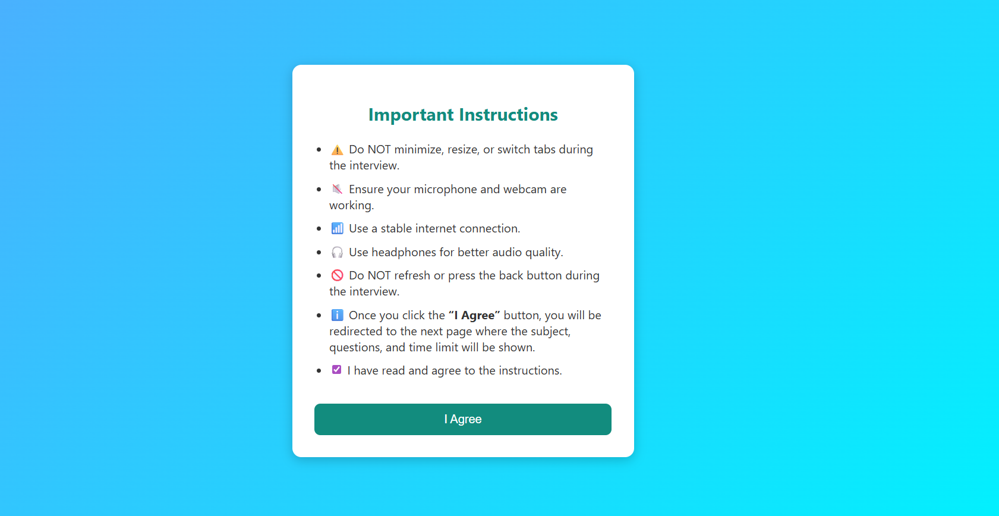
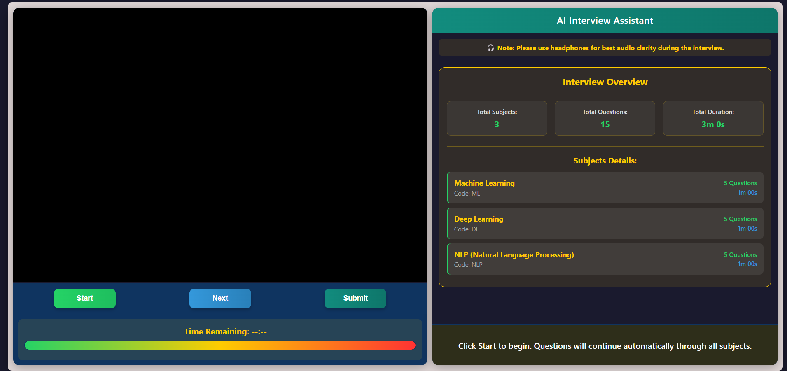

# 🎥 Live Video Recorder with Voice Transcription

This project records live video and voice from the browser and sends it to a Python Flask backend, where it:

1. 📤 Uploads the video to Google Drive  
2. 🧠 Transcribes voice to text using a speech recognition model  
3. 💬 Displays the transcribed text in real-time on the right chat panel

---

## 🔐 Login System

This app begins with a secure **Login Page** for authentication.

### ✨ Login Features:
- Clean responsive design
- Input validation
- Redirects to main interview page after successful login

### 🔑 Default Credentials:
- Username: user
- Password: 1234

🧠 **Note:** Use headphones 🎧 for best voice detection and transcription accuracy.

---

## 🧠 Application Features (After Login)

- 🎥 Live webcam and microphone recording
- 🧾 Real-time speech-to-text transcription (shown like chat)
- 📤 Video is uploaded to Google Drive from the Flask backend
- 🤖 Emotion analysis using DeepFace (optional extension)
- 📚 User can select subject; related interview questions are asked

---

## 🔧 Technologies Used

### 🖥️ Frontend:
- HTML  
- CSS  
- JavaScript  
- MediaRecorder API  
- Web Speech API (for voice-to-text)

### 🔙 Backend:
- Python Flask  
- Google Drive API  
- DeepFace  
- OpenCV  
- SpeechRecognition  

---

## 🚀 How to Use

1. Open the live project 👉 [`Click Here`](https://avinash-prajapat.github.io/video-analysis-frontend/)
2. 🔐 Login using the default credentials
3. 🎯 Select a subject from dropdown
4. 🎬 Click **Start** to begin video and voice recording
5. ⏭ Click **Next** to load next interview question
6. 📤 Click **Submit** to upload your recording to Google Drive
7. 💬 Transcribed voice will appear on the right like a chat conversation

---

## 📸 Preview
## Login Page

## Signup Page

## Instructions Page

## Dashboard Page
 <!-- You can replace this with your actual screenshot or GIF -->

---

## ✨ Created By

> 👨‍💻 Vaibhav Bhardwaj 
> MCA-AIML Student (2024-26)  
> 🔗 [GitHub Profile](https://github.com/mrvaibhavbhardwaj)

